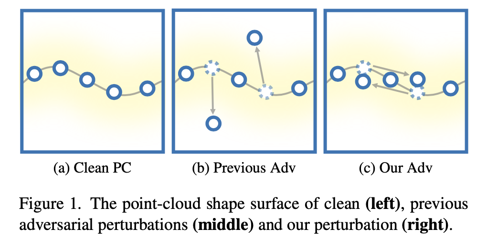

# Shape-invariant 3D Adversarial Point Clouds (CVPR 2022)
This repository provides the official PyTorch implementation of the following conference paper: 
> [**Shape-invariant 3D Adversarial Point Clouds (CVPR 2022)**](https://arxiv.org/abs/2203.04041) <br>
> [Qidong Huang](http://home.ustc.edu.cn/~hqd0037/)<sup>1</sup>, 
> [Xiaoyi Dong](https://scholar.google.com/citations?user=FscToE0AAAAJ&hl=en)<sup>1</sup>, 
> [Dongdong Chen](https://www.dongdongchen.bid/)<sup>2</sup>, 
> [Hang Zhou](http://www.sfu.ca/~hza162/)<sup>3</sup>, 
> [Weiming Zhang](http://staff.ustc.edu.cn/~zhangwm/index.html)<sup>1</sup>, 
> [Nenghai Yu](https://scholar.google.com/citations?user=7620QAMAAAAJ&hl=en)<sup>1</sup> <br>
> <sup>1</sup>University of Science and Technology of China, <sup>2</sup>Microsoft Cloud AI, <sup>3</sup>Simon Fraser University <br>
>


<p align="center"></p>


## TL;DR quick start
To setup a conda environment, download the required dataset, and begin the attack process:
```
conda env create -f environment.yml
conda activate si_adv_pc
bash download.sh
python main.py --transfer_attack_method ifgm_ours 
```

## Setup
The code is tested with Python3.7, Pytorch >= 1.6 and CUDA >= 10.2, including the following dependencies:

* tqdm >= 4.52.0
* numpy >= 1.19.2
* scipy >= 1.6.3
* open3d >= 0.13.0
* torchvision >= 0.7.0
* scikit-learn >= 1.0

When running the code on CurveNet for the first time, it will take a few minutes to automatically compile the cuda extension. 
Here we list our dependencies for reference:

* gcc == 9.4.0
* ninja == 1.7.2

## Preparation
Download the aligned [ModelNet40](https://shapenet.cs.stanford.edu/media/modelnet40_normal_resampled.zip) dataset and [ShapeNetPart](https://shapenet.cs.stanford.edu/ericyi/shapenetcore_partanno_segmentation_benchmark_v0.zip) dataset in their point cloud format and unzip them into your own dataset path.

Download the [pretrained models](https://drive.google.com/file/d/1L25i0l6L_b1Vw504WQR8-Z0oh2FJA0G9/view?usp=sharing) we provided for attack evaluation and unzip them at ```./checkpoint```. The available models include 
[PointNet](https://github.com/charlesq34/pointnet), 
[PointNet++](https://github.com/charlesq34/pointnet2), 
[DGCNN](https://github.com/WangYueFt/dgcnn), 
[PointCNN](https://github.com/yangyanli/PointCNN), 
[PointConv](https://github.com/DylanWusee/pointconv_pytorch), 
[RS-CNN](https://github.com/Yochengliu/Relation-Shape-CNN), 
[PCT](https://github.com/Strawberry-Eat-Mango/PCT_Pytorch), 
[PAConv](https://github.com/CVMI-Lab/PAConv), 
[SimpleView](https://github.com/princeton-vl/SimpleView) and 
[CurveNet](https://github.com/tiangexiang/CurveNet).


## White-box attack
To implement white-box shape-invariant attack on PointNet, please run the following command:
```
python main.py 
--dataset ModelNet40
--data_path /your/path/to/dataset/
--transfer_attack_method ifgm_ours 
--surrogate_model pointnet_cls 
--target_model pointnet_cls 
--step_size 0.007 
--max_steps 50 
--eps 0.16
```

## Black-box transfer-based attack
To implement transfer-based attack from PointNet to black-box target CurveNet, please run the following command:
```
python main.py 
--dataset ModelNet40
--data_path /your/path/to/dataset/
--transfer_attack_method ifgm_ours 
--surrogate_model pointnet_cls 
--target_model curvenet
--step_size 0.007 
--max_steps 50 
--eps 0.16
```

## Black-box query-based attack
To implement black-box query-based shape-invariant attack, if you choose DGCNN as the surrogate model to attack target black-box PAConv, please run the following command:
```
python main.py 
--dataset ModelNet40
--data_path /your/path/to/dataset/
--query_attack_method ours 
--surrogate_model dgcnn 
--target_model paconv
--step_size 0.32
```

## Citation
If you find this work useful for your research, please cite our [paper](https://arxiv.org/abs/2203.04041):
```
@article{huang2022siadv,
  title={Shape-invariant 3D Adversarial Point Clouds},
  author={Qidong Huang and Xiaoyi Dong and Dongdong Chen and Weiming Zhang and Nenghai Yu},
  journal={Proceedings of the IEEE/CVF Conference on Computer Vision and Pattern Recognition},
  year={2022}
}
```

## License
The code is released under MIT License (see LICENSE file for details).

